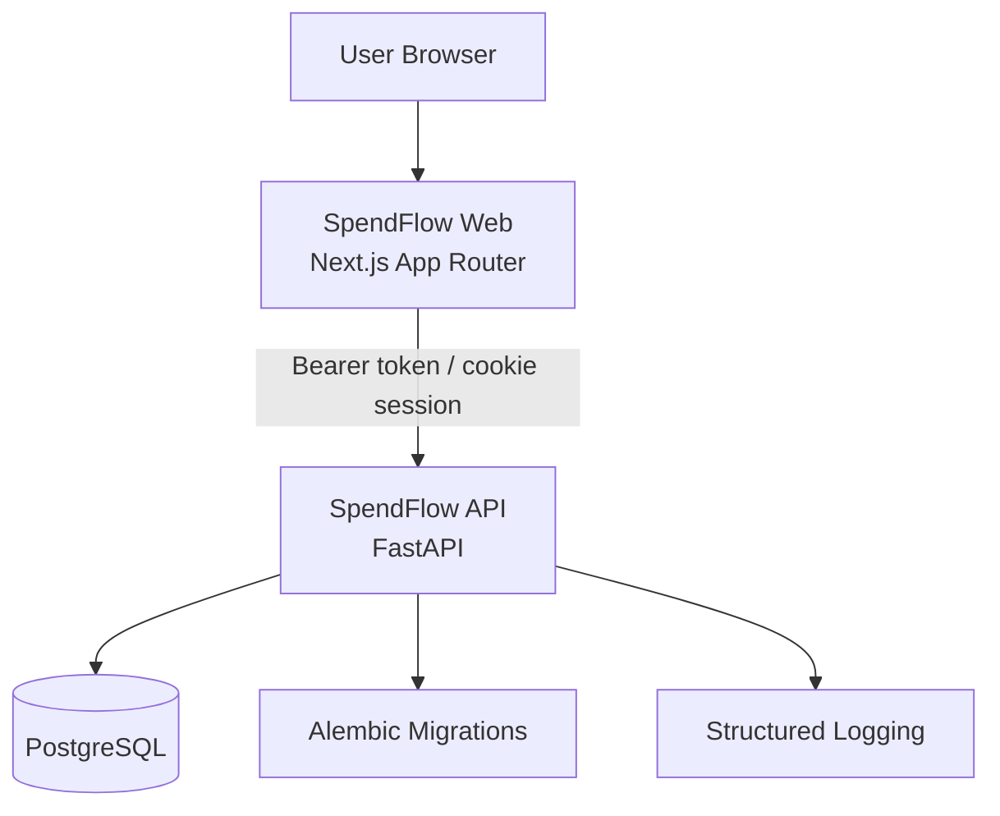

# SpendFlow

SpendFlow is a personal finance platform with:

- A FastAPI backend for accounts, transactions, budgets, recurring rules, projections, categories, and user preferences.
- A Next.js web app for authentication and daily finance workflows.

V1 scope focuses on asset accounts only (checking and savings).

## Architecture



## Monorepo Layout

- `src/`: FastAPI backend
- `alembic/`: database migrations
- `tests/`: backend automated tests
- `web/`: Next.js frontend
- `docs/`: architecture and migration docs
- `docker-compose.yaml`: PostgreSQL + backend API services

## Backend Highlights

- JWT auth with registration and login.
- User profile endpoint and persisted UI preferences endpoint.
- Account lifecycle with soft-delete and restore.
- Opening balance support recorded as ledger entries.
- Transactions for income and expense, plus manual adjustments.
- Atomic transfers between accounts.
- Category groups, categories, and category catalog endpoint.
- Budgets scoped to category or category group.
- Budget list filtering by lifecycle/date and budget cloning.
- Recurring rules with interval support and weekend adjustment.
- Calendar projection endpoint with projected running balances.
- Security middleware (rate limiting + security headers).
- Centralized exception handling and `/health` check.

## Web App Highlights

- Next.js App Router frontend (`web/`) with protected finance pages.
- Session cookie auth middleware and server-side auth helpers.
- Screens for dashboard, accounts, transactions, budgets, recurring, and calendar.
- Login and registration flows wired to backend auth endpoints.
- Server actions for creating/updating accounts, transactions, budgets, and recurring rules.
- User preferences proxy API route (`/api/user-preferences`) to backend preferences.
- Mock fallback datasets used when no authenticated session is present.

## API Endpoints (v1)

All endpoints below are prefixed by `/api/v1` unless noted.

### Authentication

- `POST /auth/register` - Register user
- `POST /auth/login` - Login and get JWT
- `GET /auth/me` - Get current user profile
- `GET /auth/preferences` - Get persisted UI preferences
- `PUT /auth/preferences` - Update persisted UI preferences

### Accounts

- `POST /accounts` - Create account (optional opening balance)
- `GET /accounts` - List active accounts
- `GET /accounts/{account_id}` - Get one account
- `PUT /accounts/{account_id}` - Update account
- `DELETE /accounts/{account_id}` - Soft-delete account
- `POST /accounts/{account_id}/restore` - Restore account

### Transactions

- `POST /transactions` - Create income/expense transaction
- `POST /transactions/adjustments` - Create manual adjustment
- `POST /transactions/transfers` - Create transfer between accounts
- `GET /transactions` - List transactions with filters
- `GET /transactions/{transaction_id}` - Get one transaction
- `PUT /transactions/{transaction_id}` - Update transaction
- `DELETE /transactions/{transaction_id}` - Delete transaction

### Categories

- `GET /categories` - List categories (optional `type`, `group_id`)
- `POST /categories` - Create category
- `GET /categories/groups` - List category groups
- `POST /categories/groups` - Create category group
- `GET /categories/catalog` - List grouped catalog for UI selection

### Budgets

- `POST /budgets` - Create budget
- `GET /budgets` - List budgets with filters (`status`, `year`, `month`, `period_start_from`, `period_end_to`)
- `GET /budgets/{budget_id}` - Get budget
- `PUT /budgets/{budget_id}` - Update budget
- `POST /budgets/{budget_id}/clone` - Clone budget into another period
- `DELETE /budgets/{budget_id}` - Delete budget

### Calendar and Recurring Rules

- `GET /calendar/projection?account_id=...&month=...&year=...` - Project recurring entries with running projected balance
- `POST /calendar/rules` - Create recurring rule
- `GET /calendar/rules` - List recurring rules (optional `account_id`)
- `GET /calendar/rules/{rule_id}` - Get recurring rule
- `PUT /calendar/rules/{rule_id}` - Update recurring rule
- `DELETE /calendar/rules/{rule_id}` - Delete recurring rule

### System

- `GET /health` - API/database health check
- `GET /` - API status/version payload

## Data Model Snapshot

- `User`: identity, auth, locale/timezone/currency, weekend default, UI preferences.
- `Account`: name, type (`checking`/`savings`), balance, soft-delete timestamp.
- `Transaction`: amount, type, kind (`regular`, `opening_balance`, `adjustment`, `transfer`), category and transfer links.
- `CategoryGroup` and `Category`: categorized spending/income structure for budgeting.
- `Budget`: amount, period, scope (`category`/`group`), computed lifecycle (`active`, `upcoming`, `archived`), spent/remaining.
- `RecurringRule`: frequency (`daily`, `weekly`, `monthly`, `yearly`), interval, weekend adjustment (`keep`, `following`, `preceding`).

## Local Development

### Prerequisites

- Python 3.13+
- Poetry
- Node.js 20+
- npm
- PostgreSQL 16+

### Backend Setup

1. Install dependencies:

```bash
poetry install
```

2. Create `.env` at repository root with at least:

```env
DATABASE_URL=postgresql+asyncpg://<user>:<password>@localhost:5432/<db>
SECRET_KEY=<strong-random-secret>
CORS_ORIGINS=http://localhost:3000
```

3. Run migrations:

```bash
poetry run alembic upgrade head
```

4. Start API:

```bash
poetry run uvicorn src.main:app --reload --host 0.0.0.0 --port 8000
```

API base URL: `http://localhost:8000`

### Web Setup

1. Install frontend dependencies:

```bash
cd web
npm install
```

2. Create `web/.env.local` (recommended):

```env
SPENDFLOW_API_URL=http://localhost:8000
```

3. Start web app:

```bash
npm run dev
```

Web URL: `http://localhost:3000`

## Docker

From repository root:

```bash
docker compose up --build
```

This starts:

- PostgreSQL (`db`) on port `5432`
- FastAPI app (`app`) on port `8000`

The backend container entrypoint runs `alembic upgrade head` before starting Uvicorn.

## Testing and Quality

From repository root:

```bash
poetry run pytest
poetry run ruff check .
```

From `web/`:

```bash
npm run lint
```

## Additional Docs

- `docs/ARCHITECTURE.md`
- `docs/DATABASE_MIGRATIONS.md`
- `docs/VIRTUAL_ENGINE.md`
